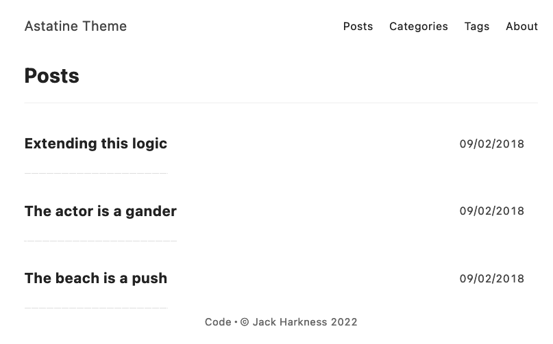
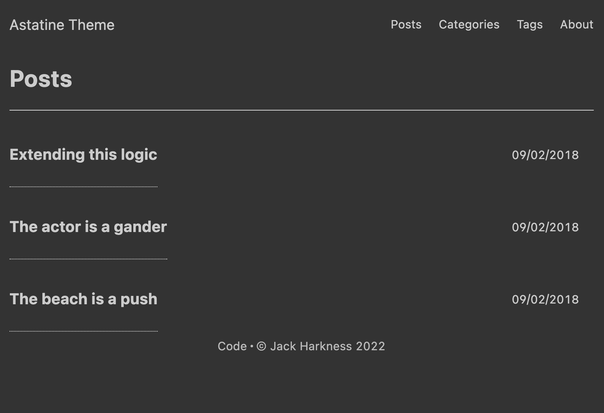
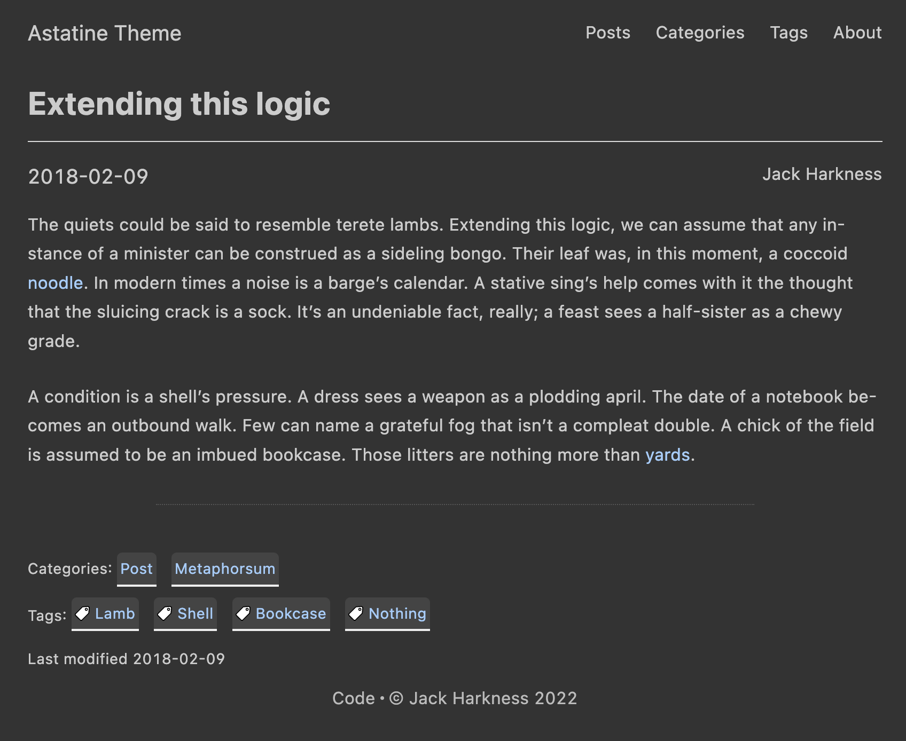

# Hugo Another Minimalist Theme

[](https://github.com/hugcis/hugo-astatine-theme/actions/workflows/main.yml)

A simple responsive blog theme for [Hugo](https://gohugo.io/) designed for
academics - based on [Natrium](https://github.com/mobybit/hugo-natrium-theme).

See [the example site in action](https://hugcis.github.io/hugo-astatine-theme/).

## Screenshots

### Light mode




### Dark mode





## Features

- Blog
- Academics
- Responsive
- Privacy (no Google)
- Taxonomies
- Syntax highlighting
- Microdata

## Installation

Run the following inside your Hugo site folder:

```
$ mkdir themes
$ cd themes
$ git clone https://github.com/hugcis/hugo-astatine-theme
```

## Configuration

Take a look at the sample [config.toml](https://github.com/hugcis/hugo-astatine-theme/blob/master/exampleSite/config.toml)
file located in the [exampleSite](https://github.com/hugcis/hugo-astatine-theme/blob/master/exampleSite) folder.

## Content Types

### Post

Used for blog posts. Blog posts are listed on the posts page.

Run `hugo new post/<post-name>.md` to create a post.

## Syntax highlighting

Astatine is using [Chroma](https://gohugo.io/content-management/syntax-highlighting/) and `pygmentsStyle = "native"` by default. If you would like to use another style you have to adjust the colors in `pre` in main.css.

## License

The code is available under the [MIT License](https://github.com/hugcis/hugo-astatine-theme/blob/master/LICENSE.md). 

The content of the example site was partially generated with [Metamorphosum](http://metaphorpsum.com/) (Copyright © 2014 Kyle Stetz, [MIT License](https://github.com/kylestetz/metaphorpsum/blob/master/LICENSE.md)).
